# ꓘamerka GUI

## Ultimate Internet of Things/Industrial Control Systems reconnaissance tool.

### Powered by Shodan - Supported by Binary Edge & WhoisXMLAPI

## NSA and CISA Recommend Immediate Actions to Reduce Exposure Across Operational Technologies and Control Systems

> Shodan, Kamerka, are creating a “perfect storm” of 
> 
> 1) easy access to unsecured assets, 
> 
> 2) use of common, open-source information about devices, and 
> 
> 3) an extensive list of exploits deployable via common exploit frameworks (e.g., Metasploit, Core Impact, and Immunity Canvas).

https://us-cert.cisa.gov/ncas/alerts/aa20-205a

## Usage

#### 1. Scan for Internet facing Industrial Control Systems, Medical and Internet of Things devices based on country or coordinates.
#### 2. Gather passive intelligence from WHOISXML, BinaryEdge and Shodan or active by scanning target directly.
#### 3. Thanks to indicators from devices and google maps, pinpoit device to specific place or facility (hospital, wastewater treatment plant, gas station, university, etc.)
#### 4. (Optional, not recommended) 4. Guess/Bruteforce or use default password to gain access to the device. Some exploits are implemented for couple specific IoTs.
#### 5. Report devices in critical infrastructure to your local CERT.

## Features
- More than 100 ICS devices
- Gallery section shows every gathered screenshot in one place
- Interactive Google maps
- Google street view support
- Possibility to implement own exploits or scanning techiques
- Support for NMAP scan in xml format as an input
- Find the route and change location of device
- Statistics for each search
- Search Flick photos nearby your device
- Position for vessels is scraped from device directly, rather than IP based
- Some devices return hints or location in the response. It's parsed and displayed as an indicator that helps to geolocate device.

## Articles
https://www.offensiveosint.io/hack-the-planet-with-amerka-gui-ultimate-internet-of-things-industrial-control-systems-reconnaissance-tool/

https://www.offensiveosint.io/offensive-osint-s01e03-intelligence-gathering-on-critical-infrastructure-in-southeast-asia/

https://www.offensiveosint.io/hack-like-its-2077-presenting-amerka-mobile/

https://www.zdnet.com/article/kamerka-osint-tool-shows-your-countrys-internet-connected-critical-infrastructure/

https://www.icscybersecurityconference.com/intelligence-gathering-on-u-s-critical-infrastructure/

## Installation

### Requirements
- beautiful soup
- python3
- django
- pynmea2
- celery
- redis
- Shodan paid account
- BinaryEdge (Optional)
- WHOISXMLAPI (Optional)
- Flickr (Optional)
- Google Maps API
- Pastebin PRO (Optional)
- xmltodict
- python-libnmap


**Make sure your API keys are correct and put them in keys.json in main directory.**

### Run
```
git clone https://github.com/woj-ciech/Kamerka-GUI/
pip3 install -r requirements.txt
python3 manage.py makemigrations
python3 manage.py migrate
python3 manage.py runserver
```

In a new window (in main directory) run celery worker
```celery worker -A kamerka --loglevel=info```

For new version of Celery
```celery --app kamerka worker```

In a new window fire up redis
```apt-get install redis```
```redis-server```

And server should be available on ```http://localhost:8000/```


## Search
### Search for Industrial Control Devices in specific country
 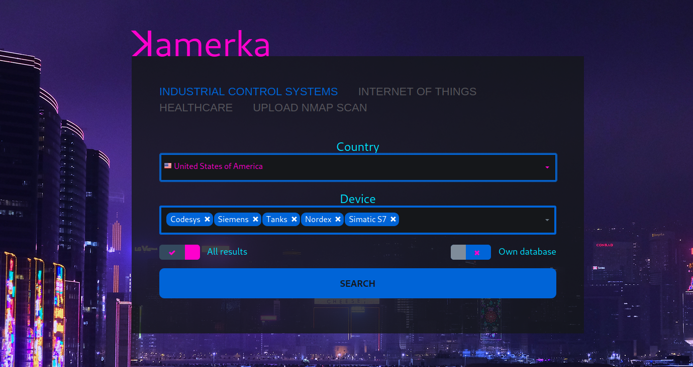

- "All results" checkbox means get all results from Shodan, if it's turned off - only first page (100) results will be downloaded.
- "Own database" checkbox does not work but shows that is possible to integrate your own geolocation database.

### Search for Internet of things in specific coordinates
Type your coordinates in format "lat,lon", hardcoded radius is 20km.
  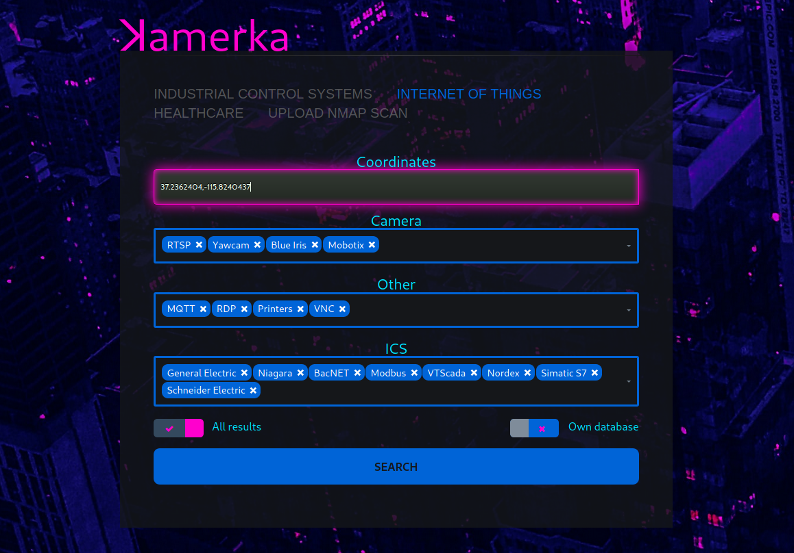

## Dashboard
   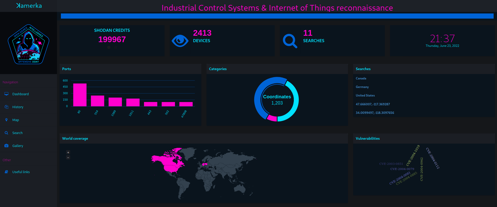

## Gallery
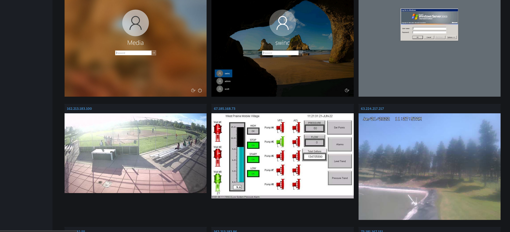

## Maps
### City map
 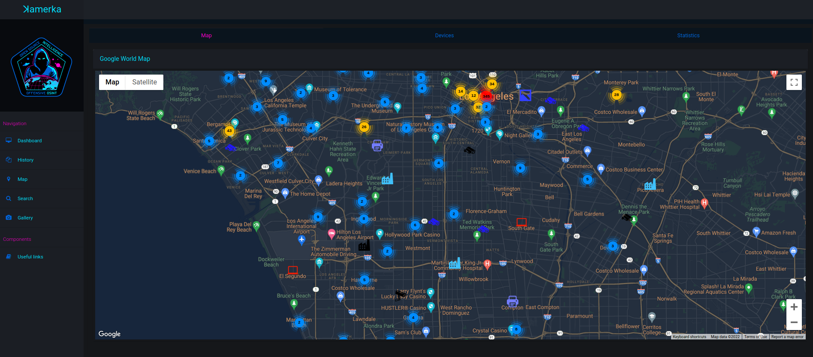

### Industrial Control Systems in Poland - ~2.5k different devices
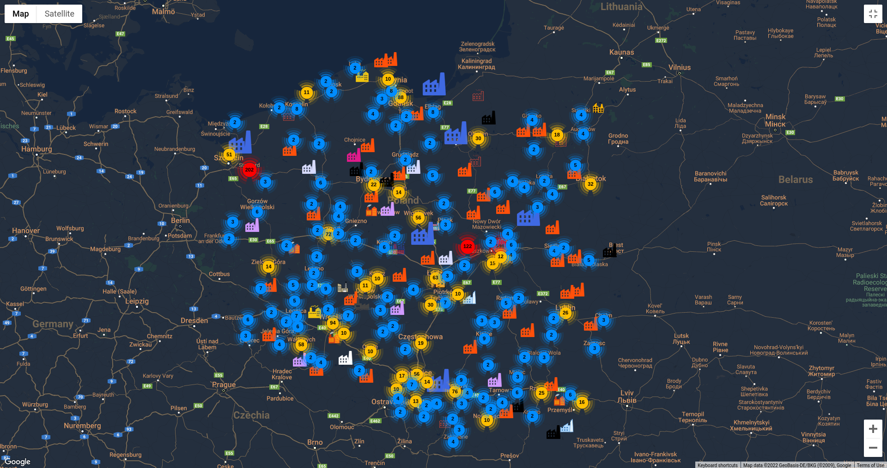

## Statistics
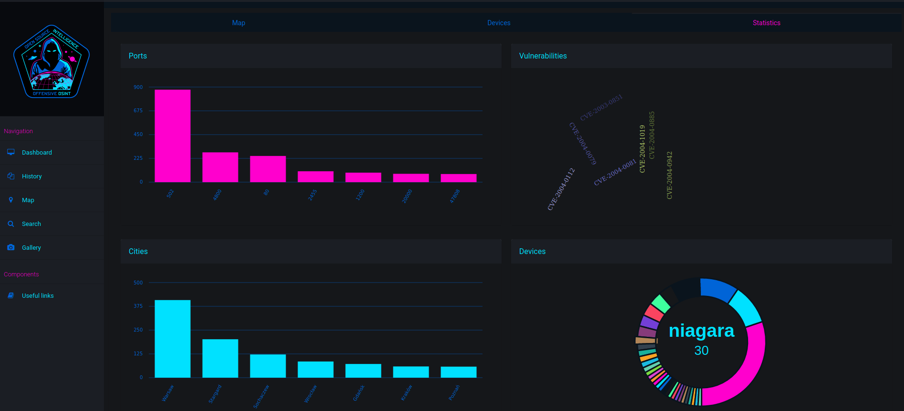

## Device map
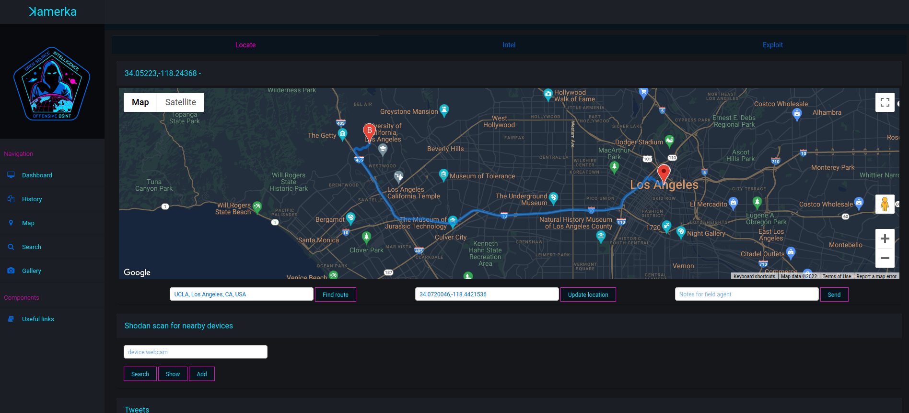

## Intel
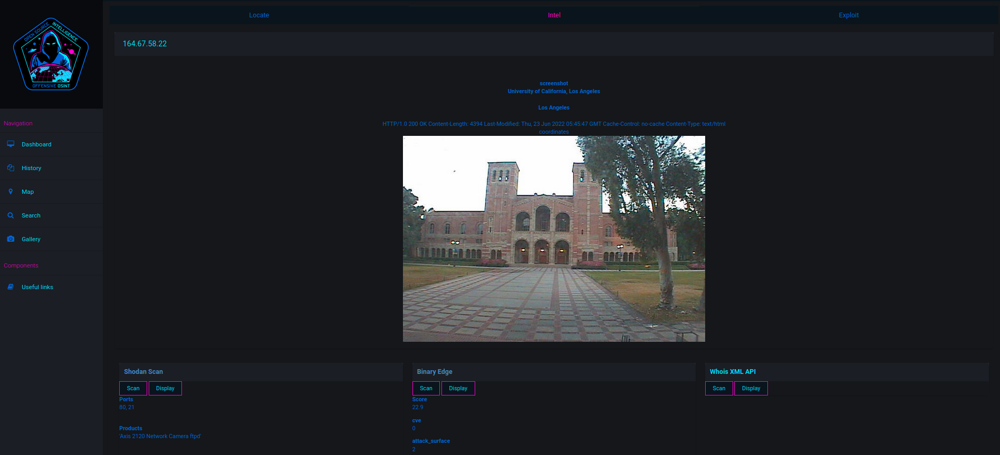

## Geolocate
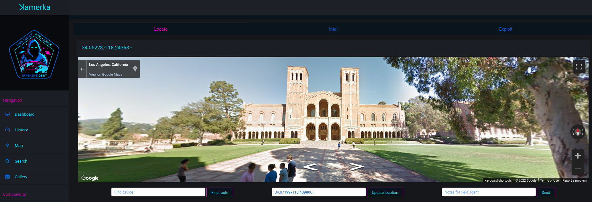

## Scan & Exploit & Information
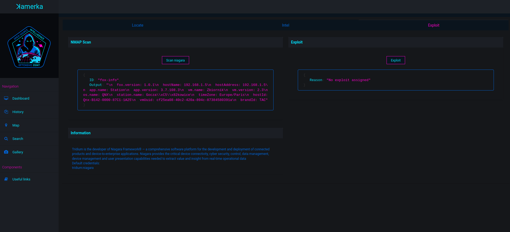

## Full list of supported devices with corresponding queries
https://github.com/woj-ciech/Kamerka-GUI/blob/master/queries.md

## NMAP Scripts
- atg-info
- codesys
- cspv4-info
- dnp3-info
- enip-info
- fox-info
- modbus-discover
- modicon-info
- omron-info
- pcworx-info
- s7-enumerate
- s7-info

## Exploits
- CirCarLife SCADA 4.3.0 - Credential Disclosure
- VideoIQ - Remote file disclosure
- Grandstream UCM6202 1.0.18.13 - Remote Command Injection
- Contec Smart Home 4.15 - Unauthorized Password Reset
- Netwave IP Camera - Password Disclosure
- Amcrest Cameras 2.520.AC00.18.R - Unauthenticated Audio Streaming
- Lutron Quantum 2.0 - 3.2.243 - Information Disclosure
- Bosch Security Systems DVR 630/650/670 Series - Multiple Vulnerabilities


## Used components
- Joli admin template - https://github.com/sbilly/joli-admin
- Search form - Colorlib Search Form v15
- country picker - https://github.com/mojoaxel/bootstrap-select-country
- Multiselect - https://github.com/varundewan/multiselect/
- Arsen Zbidniakov Flat UI Checkbox https://codepen.io/ARS/pen/aeDHE/
- icon from icons8.com and icon-icons.com
- Nmap Scripts from NMAP Script Engine and Digital Bond repository
- Exploits from exploit-db and routersploit

## Additional
- I'm not responsible for any damage caused by using this tool.
