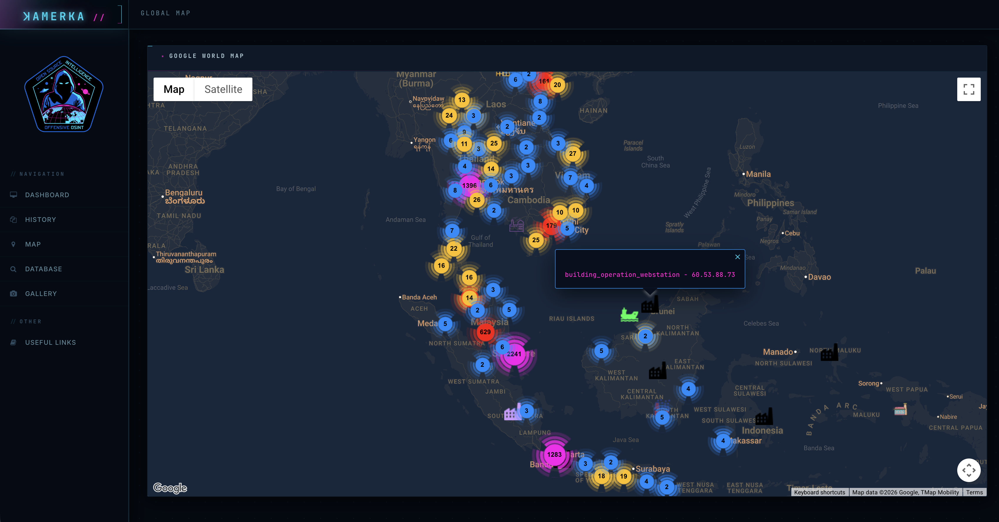
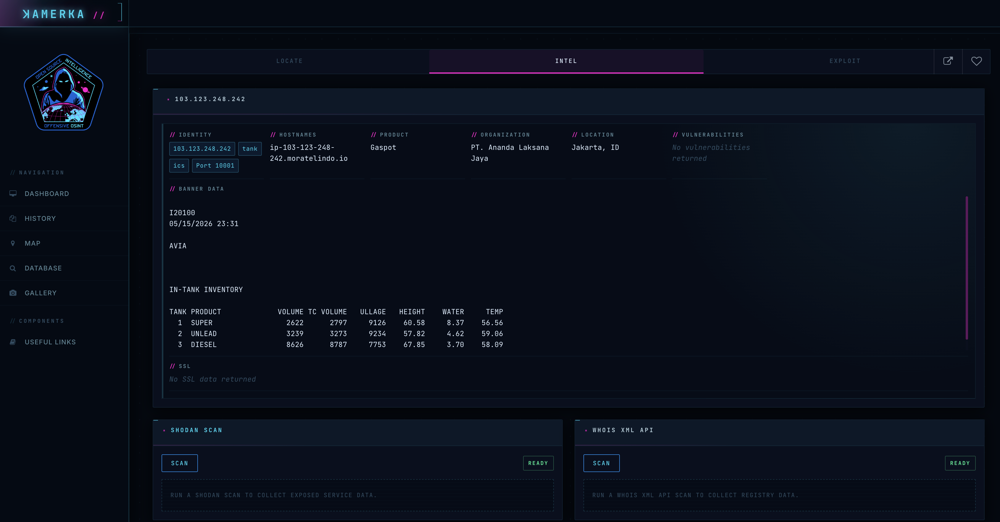
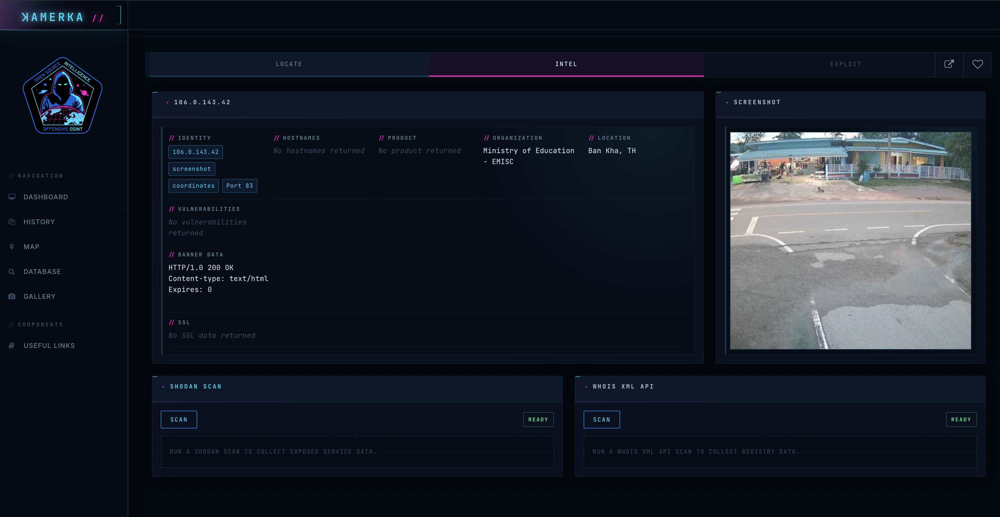
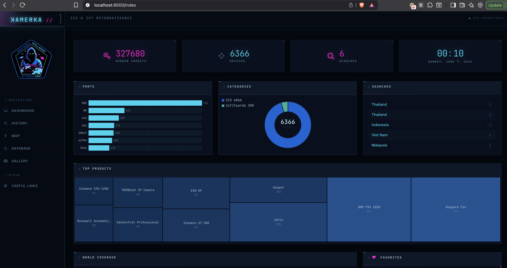

# Kamerka GUI

Kamerka GUI is a Django-based reconnaissance dashboard for discovering, reviewing, and triaging Internet-exposed ICS, IoT, medical devices. It combines Shodan search data, Google Maps visualization, device screenshots, passive intelligence enrichment, and selected scan/exploit helpers into one web interface.

Use it only for authorized research, asset inventory, defensive exposure management, and reporting to the appropriate owners or CERT/CSIRT teams.

<p align="center">
  
</p>

## What It Does

- Searches Shodan for ICS, IoT, healthcare, and attacker-infrastructure device categories.
- Supports country-based searches and coordinate-based searches.
- Stores searches and discovered devices in a local Django database.
- Shows search history, dashboards, statistics, favorites, and a screenshot gallery.
- Displays devices on global and per-device Google Maps views.
- Parses device indicators from banners and protocol responses to help with geolocation.
- Shows device-level intelligence, banner data, screenshots, hostnames, organization, location, ports, products, and vulnerabilities.
- Runs Shodan host scans and Whois XML API enrichment from the Intel tab.
- Supports importing Nmap XML output and running selected Nmap NSE scans.
- Includes selected proof-of-concept exploit helpers for specific device families.

## Screenshots

### Dashboard



### Device Intel



### Device Intel With Screenshot



### Screenshot Gallery


### Map



## Main Views

- `Dashboard`: high-level counts, Shodan credits, recent searches, charts, world coverage, and favorites.
- `Database`: searchable table of all discovered devices with filtering for likely honeypots.
- `History`: previous searches with country names, selected device categories, and links to results.
- `Map`: global clustered Google Map of discovered devices.
- `Gallery`: all collected device screenshots, with country filtering.
- `Results`: per-search device table, map, statistics, and export-style browsing.
- `Device`: Locate, Intel, and Exploit tabs for a single device.

## Requirements

- Python 3.10 to 3.13 recommended for the maintained Django 5.2 and Celery stack.
- Redis server for Celery background jobs.
- Shodan API key. A paid account is recommended because broad searches consume credits/pages.
- Google Maps JavaScript API key for maps and route/location features.
- Whois XML API key if you want Whois enrichment.
- `GeoLite2-City.mmdb` in the repository root if you want Nmap XML import geolocation.
- Nmap installed locally if you want to run active Nmap scans.

Python dependencies are listed in [requirements.txt](requirements.txt). The project now targets the Django 5.2 LTS line, Celery 5.6, and bounded Python packages so installs stay current without jumping to incompatible major versions.

## Installation

Clone the repository and create a virtual environment:

```bash
git clone https://github.com/woj-ciech/Kamerka-GUI.git
cd Kamerka-GUI
python3.12 -m venv .venv
source .venv/bin/activate
python -m pip install --upgrade pip
pip install -r requirements.txt
```

If `python3.12` is not available, use another Python 3.10-3.13 interpreter. Avoid reusing an old Python 3.8/3.9 virtual environment because the current dependency set requires Python 3.10+.

Create the database schema:

```bash
python manage.py migrate
```

Create `keys.json` in the repository root:

```json
{
  "keys": {
    "shodan": "YOUR_SHODAN_API_KEY",
    "google_maps": "YOUR_GOOGLE_MAPS_API_KEY",
    "whoisxmlapi": "YOUR_WHOIS_XML_API_KEY"
  }
}
```

Start Redis in a separate terminal:

```bash
redis-server
```

Start a Celery worker in another terminal:

```bash
source .venv/bin/activate
celery --app kamerka worker --loglevel=info
```

Start the Django development server:

```bash
source .venv/bin/activate
python manage.py runserver
```

Open the app:

```text
http://localhost:8000/
```

## Configuration Notes

- `keys.json` is required at runtime because the app reads API keys from `keys['keys']`.
- Keep `keys.json` out of source control. It contains private credentials.
- The default database is SQLite. This is fine for local testing; use a production database if deploying.
- Background searches, Shodan scans, Whois scans, and Nmap imports depend on Celery workers being active.
- Coordinate searches use Shodan geo queries around the supplied latitude/longitude.
- Large Shodan searches can consume credits quickly. Use page limits intentionally.

## Typical Workflow

1. Open the search page and choose an ICS, IoT, healthcare, or infrastructure search mode.
2. Select one or more device categories.
3. Pick a country or provide coordinates, then choose how many Shodan pages to collect.
4. Submit the search and wait for the Celery task to finish.
5. Review the dashboard, history, or per-search results page.
6. Open individual devices to inspect Intel, map location, screenshots, Shodan scan results, and Whois data.
7. Use active scans or exploit helpers only when you have explicit authorization.

## Supported Search Categories

The full list of supported Shodan queries is maintained in [queries.md](queries.md).

Broad categories include:

- Industrial control systems and OT protocols.
- Cameras and screenshot-capable IoT devices.
- Healthcare and medical systems.
- Building automation and smart infrastructure.
- Attacker infrastructure indicators.
- Generic exposed services such as VNC, RDP, MQTT, printers, and web cameras.

## Nmap Support

Kamerka can import Nmap XML output and includes NSE helper scripts under [nmap_scripts](nmap_scripts).

Included script families include:

- ATG
- BACnet
- Codesys
- DNP3
- EtherNet/IP
- Fox/Niagara
- Modbus
- Omron FINS
- PCWorx
- ProConOS
- Siemens S7

## Exploit Helpers

The project includes selected exploit/helper modules for specific device families, including:

- Bosch Security Systems DVR 630/650/670 Series
- VideoIQ remote file disclosure
- Hikvision backdoor-style user modification flow
- Contec Smart Home password reset behavior
- Grandstream UCM information/version check
- Netwave camera status disclosure
- CirCarLife SCADA information disclosure
- Amcrest unauthenticated audio/video endpoint helper
- Lutron Quantum information disclosure

These helpers are for controlled validation only. Do not run them against systems you do not own or have permission to test.

## Troubleshooting

- If searches never complete, confirm Redis is running and the Celery worker is connected.
- If maps do not load, confirm the Google Maps API key is valid and authorized for your host.
- If Shodan searches fail, confirm the API key has credits and the query/page count is allowed.
- If Whois enrichment is empty, confirm the Whois XML API key and quota.
- If Nmap XML import fails, confirm the XML file is valid and `GeoLite2-City.mmdb` exists in the project root.

## Security And Legal Notice

Kamerka can identify exposed critical infrastructure, IoT, and medical assets. Treat all findings responsibly:

- Use only on assets you own or are authorized to assess.
- Do not exploit, change, or disrupt third-party systems.
- Report exposed critical systems through appropriate responsible disclosure channels.
- The authors and contributors are not responsible for misuse or damage caused by this tool.

## Related Reading

- https://www.offensiveosint.io/hack-the-planet-with-amerka-gui-ultimate-internet-of-things-industrial-control-systems-reconnaissance-tool/
- https://www.offensiveosint.io/offensive-osint-s01e03-intelligence-gathering-on-critical-infrastructure-in-southeast-asia/
- https://www.offensiveosint.io/hack-like-its-2077-presenting-amerka-mobile/
- https://www.zdnet.com/article/kamerka-osint-tool-shows-your-countrys-internet-connected-critical-infrastructure/
- https://www.icscybersecurityconference.com/intelligence-gathering-on-u-s-critical-infrastructure/
- https://us-cert.cisa.gov/ncas/alerts/aa20-205a

## Credits

- Joli Admin template: https://github.com/sbilly/joli-admin
- Bootstrap Select Country: https://github.com/mojoaxel/bootstrap-select-country
- Selectr multi-select: https://github.com/Mobius1/Selectr
- Google Maps JavaScript API
- Shodan API
- Whois XML API
- Nmap Script Engine and Digital Bond NSE repositories
- Exploit references from Exploit-DB and RouterSploit
